* Table of Contents
  {:toc}

--------------------------------------------------------------------------------------------------------------------

## **Acknowledgements**

* Libraries used: [JavaFX](https://openjfx.io/), [Jackson](https://github.com/FasterXML/jackson), [JUnit5](https://github.com/junit-team/junit5), [OpenCSV](https://opencsv.sourceforge.net/)
* Adapted from: [AddressBook Level 3](https://github.com/nus-cs2103-AY2223S2/tp)

--------------------------------------------------------------------------------------------------------------------

## **Setting up, getting started**

Refer to the guide [_Setting up and getting started_](SettingUp.md).

--------------------------------------------------------------------------------------------------------------------

## **Design**

:bulb: **Tip:** The `.puml` files used to create diagrams in this document can be found in the [diagrams](https://github.com/AY2223S2-CS2103-W17-2/tp/tree/master/docs/diagrams/) folder. Refer to the [_PlantUML Tutorial_ at se-edu/guides](https://se-education.org/guides/tutorials/plantUml.html) to learn how to create and edit diagrams.

### Architecture

The ***Architecture Diagram*** given above explains the high-level design of the App.

Given below is a quick overview of main components and how they interact with each other.

#### Main components of the architecture

**`Main`** has two classes called [`Main`](https://github.com/AY2223S2-CS2103-W17-2/tp/tree/master/src/main/java/seedu/age/Main.java) and [`MainApp`](https://github.com/AY2223S2-CS2103-W17-2/tp/tree/master/src/main/java/seedu/age/MainApp.java). It is responsible for,
* At app launch: Initializes the components in the correct sequence, and connects them up with each other.
* At shut down: Shuts down the components and invokes cleanup methods where necessary.

[**`Commons`**](#common-classes) represents a collection of classes used by multiple other components.

The rest of the App consists of four components.

* [**`UI`**](#ui-component): The UI of the App.
* [**`Logic`**](#logic-component): The command executor.
* [**`Model`**](#model-component): Holds the data of the App in memory.
* [**`Storage`**](#storage-component): Reads data from, and writes data to various platforms of storage.

#### How the architecture components interact with each other

The *Sequence Diagram* below shows how the components interact with each other for the scenario where the user issues the command `delete 1`.

Each of the four main components (also shown in the diagram above),

* defines its *API* in an `interface` with the same name as the Component.
* implements its functionality using a concrete `{Component Name}Manager` class (which follows the corresponding API `interface` mentioned in the previous point.

For example, the `Logic` component defines its API in the `Logic.java` interface and implements its functionality using the `LogicManager.java` class which follows the `Logic` interface. Other components interact with a given component through its interface rather than the concrete class (reason: to prevent outside component's being coupled to the implementation of a component), as illustrated in the (partial) class diagram below.

The sections below give more details of each component.

### UI component

The **API** of this component is specified in [`Ui.java`](https://github.com/AY2223S2-CS2103-W17-2/tp/tree/master/src/main/java/seedu/age/ui/Ui.java)

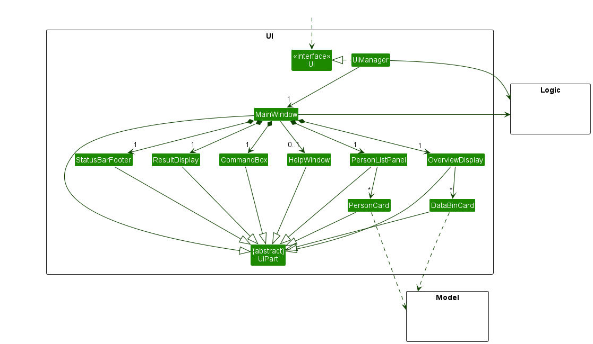

The UI consists of a `MainWindow` that is made up of parts e.g.`CommandBox`, `ResultDisplay`, `PersonListPanel`, `StatusBarFooter` etc. All these, including the `MainWindow`, inherit from the abstract `UiPart` class which captures the commonalities between classes that represent parts of the visible GUI.

The `UI` component uses the JavaFx UI framework. The layout of these UI parts are defined in matching `.fxml` files that are in the `src/main/resources/view` folder. For example, the layout of the [`MainWindow`](https://github.com/AY2223S2-CS2103-W17-2/tp/tree/master/src/main/java/seedu/age/ui/MainWindow.java) is specified in [`MainWindow.fxml`](https://github.com/AY2223S2-CS2103-W17-2/tp/tree/master/src/main/resources/view/MainWindow.fxml)

The `UI` component

* executes user commands using the `Logic` component.
* listens for changes to `Model` data so that the UI can be updated with the modified data.
* keeps a reference to the `Logic` component, because the `UI` relies on the `Logic` to execute commands.
* depends on some classes in the `Model` component, as it displays `Person` objects residing in the `Model`.

### Logic component

**API** : [`Logic.java`](https://github.com/AY2223S2-CS2103-W17-2/tp/tree/master/src/main/java/seedu/age/logic/Logic.java)

Here is a (partial) class diagram of the `Logic` component:

How the `Logic` component works:
1. When `Logic` is called upon to execute a command, it uses the `DengueHotspotTrackerParser` class to parse the user command.
1. This results in a `Command` object (more precisely, an object of one of its subclasses e.g., `AddCommand`) which is executed by the `LogicManager`.
1. The command can communicate with the `Model` when it is executed (e.g. to add a case).
1. The result of the command execution is encapsulated as a `CommandResult` object which is returned back from `Logic`.

The Sequence Diagram below illustrates the interactions within the `Logic` component for the `execute("delete 1")` API call.

Here are the other classes in `Logic` (omitted from the class diagram above) that are used for parsing a user command:

How the parsing works:
* When called upon to parse a user command, the `DengueHotspotTrackerParser` class will do one of the following:
  * create an `XYZCommandParser` (`XYZ` is a placeholder for the specific command name e.g., `AddCommandParser`) which uses the other classes shown above to parse the user command and create a `XYZCommand` object (e.g., `AddCommand`) that the `DengueHotspotTrackerParser` returns back as a `Command` object.
  * create an `XYZCommand`.
* All `XYZCommandParser` classes (e.g. `AddCommandParser`, `DeleteCommandParser`) inherit from the `Parser` interface so that they can be treated similarly where possible e.g, during testing.
* Similarly, all `XYZCommand` classes inherit from the `Command` abstract class and are executable.

### Model component

**API** : [`Model.java`](https://github.com/AY2223S2-CS2103-W17-2/tp/tree/master/src/main/java/seedu/age/model/Model.java)

Here is a (partial) class diagram of the `Model` component:

The `Model` component

* stores the Dengue Hotspot Tracker data, i.e. all `Person` objects (which are contained in a `UniquePersonList` object).
* stores the currently 'selected' `Person` objects (e.g. results of a search query) as a separate _filtered_ list which is exposed to outsiders as an unmodifiable `ObservableList<Person>` that can be 'observed' e.g. the UI can be bound to this list so that the UI automatically updates when the data in the list change.
* stores an `Overview` object that manages the histogram-like data of the current `UniquePersonList`. It is updated whenever the `Model` is updated with a command execution.
* stores a `UserPref` object that represents the user’s preferences. This is exposed to the outside as a `ReadOnlyUserPref` objects.
* does not depend on any of the other three components (as the `Model` represents data entities of the domain, they should make sense on their own without depending on other components)

:information_source: **Note:** An alternative (arguably, a more OOP) model is given below. It has a `Variant` list in the `DengueHotspotTracker`, which `Person` references. This allows `DengueHotspotTracker` to only require one `Variant` object per unique dengue variant, instead of each `Person` needing their own `Variant` objects. 

Here are some more details on how `Overview` is designed:

How the `Overview` component works:
* There are 3 implementations of `Overview`: `AgeOverview`, `PostalOverview` and `VariantOverview`. Only one is active in a `Model` at a time.
* Each of these implementations has a respective `Analyst` class, which sorts `Person` objects into groups and counts the number in each.
  * The way a `Person` is sorted depends on the type of `Analyst` employed.
  * e.g. for `AgeAnalyst`, `Person` instances who fall in the same age group will be placed in the same bin.
* This sorting and counting is aided with the use of simple `DataBin` objects, which store only a count and a group name. 

Overall, we have this flow:
1. An `XYZOverview` is instantiated or updated with a list of `Person` objects.
1. Doing so will create a new `XYZAnalyst` object with the given `Person` list as the input.
1. Upon instantiation of `XYZAnalyst`, the input list is sorted into `DataBin` objects.
1. The summary of the data can then be obtained.

### Storage component

**API** : [`Storage.java`](https://github.com/AY2223S2-CS2103-W17-2/tp/tree/master/src/main/java/seedu/age/storage/Storage.java)

The `Storage` component can be divided into two main components, one for `temporary` storage, and one for permanent storage of the file.
The permanent storage component
* can save both Dengue Hotspot Tracker data and user preference data in csv format, and read them back into corresponding objects.
* inherits from both `DengueHotspotStorage` and `UserPrefStorage`, which means it can be treated as either one (if only the functionality of only one is needed).
* depends on some classes in the `Model` component (because the `Storage` component's job is to save/retrieve objects that belong to the `Model`).

The `temporary` component temporarily saves `DengueHotspotTracker` data while the app is running to support `undo` and `redo` commands. To prevent taking up too much memory,
only up to 10 states of the `DengueHotspotTracker`. This component supports
* undoing and redoing up to a maximum of 10 steps.
* multiple undo and redo operations at once.

Once a user makes a change to the state of the `DengueHotspotTracker` after an undo operation is called, redos will no longer be possible, and all other "future" states of the `DengueHotspotTracker`
will be cleared.

### Common classes

Classes used by multiple components are in the `seedu.dengue.commons` package.

--------------------------------------------------------------------------------------------------------------------

## **Implementation**

This section describes some noteworthy details on how certain features are implemented.

### Add feature

#### Implementation

The add feature is accessed through the `addPerson` operation that allows users to add a new case to the `Person` class of the application.

The `Person` added by the user has four compulsory fields and one optional field.
* `Name` of the person
* `Date` of the case
* `Postal` code of the case
* `Age` of the person
* `Variant` of the case (optional)

The `addPerson` operation is facilitated by `AddCommand` which extends from `Command`. 

Step 1. `DengueHotspotTracker#parseCommand()` checks that the user input matches that the `COMMAND_WORD` of `AddCommand`

Step 2. `AddPersonParse#parse()` will process the additional inputs and return an `AddCommand`.

Step 3. `AddCommand` is executed and `AddCommand#execute()` triggers the `Model` interface's `Model#addCommand()`.

Step 4. `DengueHotspotTracker#addPerson` will add a person to a `uniquePersonList` via the `uniquePersonList#add()` command.

Step 5. Additionally `StorageManager#saveDengueHotspotTracker()` is called every time after a command to save the event to `data/denguehotspottracker.csv`.

The following sequence diagram will illustrate how `addPerson` operation works:

[!AddPersonSequenceDiagram](images/AddPersonSequenceDiagram.png)

### Edit feature

#### Implementation

The implementation for the `edit` command is largely similar to that of the [`add`](#add-feature) command.

### Multi-index delete feature

#### Implementation

The multi-index delete mechanism is primarily facilitated by the `DengueHotspotTrackerParser#parseCommand()`, `DeleteCommandParser#parse()`, and `DeleteCommand#execute()` methods.

Given below is an example usage scenario and how the multi-index delete mechanism behaves at each step.

Step 1. The user launches the application and uses the `find` command to filter the list of cases. The `ModelManager`’s `FilteredList<Person>` is updated.

Step 2. The user executes the `delete 1 3` command to delete the first and third cases in the filtered list currently being shown. `DengueHotspotTrackerParser#parseCommand()` parses the command and, detecting the `delete` command word, passes the argument `1 3` to the `DeleteCommandParser`.

Step 3. `DeleteCommandParser#parse()` is called. A list of valid indexes `List<Index>` is returned, and a `DeleteCommand` is constructed, taking in this list of indexes as an argument.

Step 4. `DeleteCommand#execute()` will get the most updated list of filtered cases and delete the cases associated with each given index. Users will be notified with a message upon successful deletion of all relevant cases.

The following sequence diagram shows how the multi-index delete operation works:

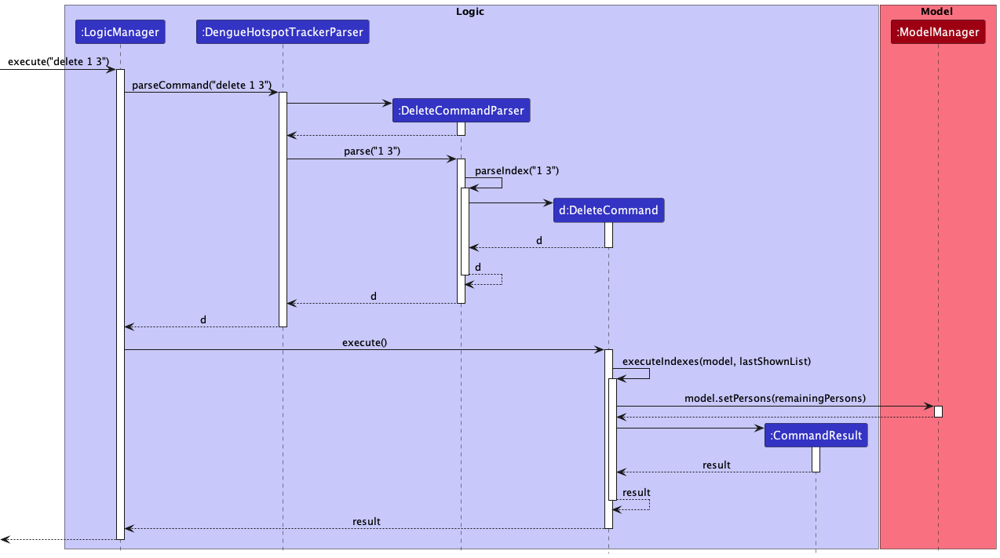

The following activity diagram summarises what happens when a user executes a multi-index delete command:

#### Design Considerations

**Aspect: How multi-index delete indicates successful execution**

* **Alternative 1 (current choice):** Display a message indicating that a number of cases were successfully deleted, the number of cases corresponding to the size of the list of indexes.
    * Pros: Short and succinct, without taking up too much space on the GUI.
    * Cons: Does not show exactly which cases were deleted.

* **Alternative 2:** Display a message indicating successful deletion for each individual deleted case, along with the details of the deleted case.
    * Pros: Shows exactly which cases were deleted for easy validation.
    * Cons: Unnecessarily lengthy; may take up too much space if many cases were deleted at once.

### Delete-by-date feature

#### Implementation

The delete-by-date mechanism is primarily facilitated by the `DengueHotspotTrackerParser#parseCommand()`, `DeleteCommandParser#parse()`, and `DeleteCommand#execute()` methods.

Given below is an example usage scenario and how the delete-by-date mechanism behaves at each step.

Step 1. The user launches the application and uses the `find` command to filter the list of cases. The `ModelManager`’s `FilteredList<Person>` is updated.

Step 2. The user executes the `delete d/2023-03-30` command to delete all cases from 30th March 2023 in the filtered list currently being shown. `DengueHotspotTrackerParser#parseCommand()` parses the command and, detecting the `delete` command word, passes the argument `d/2023-03-30` to the `DeleteCommandParser`.

Step 3. `DeleteCommandParser#parse()` is called. The date `2023-03-30` is extracted, and a `DeleteCommand` is constructed, taking in this date as a Date object argument.

Step 4. `DeleteCommand#execute()` will get the most updated list of filtered cases and delete the cases from the given date. Users will be notified with a message upon successful deletion of all relevant cases stating the number of cases deleted and the date the cases were from.

To see how the delete-by-date mechanism works, as well as to understand the design considerations taken, you may refer to the multi-index delete feature’s sequence diagram, as they work largely similarly besides the parsing of dates and the use of the `executeDate` method instead.

The following activity diagram summarises what happens when a user executes a delete-by-date command:

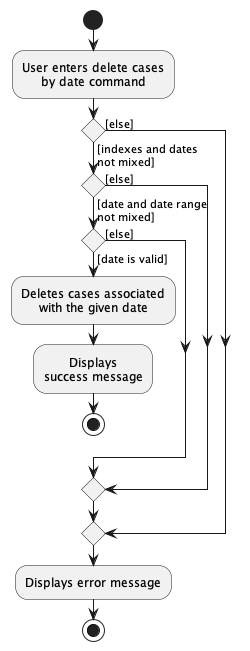

#### Design Considerations

**Aspect: What attributes the `delete` command can delete by**

* **Alternative 1 (current choice):** Allow users to `delete` only by date.
    * Pros: Provides a convenient shortcut for the most probable use case out of all batch-delete use cases,
      rather than clogging up the app with features that will likely go unused.
    * Cons: The user may be confused at the difference in affordances between `delete` and the other commands
      that similarly allow for prefixes to target a particular attribute, such as `edit` and `find`.

* **Alternative 2:** Allow users to `delete` by all attributes, e.g. delete by name, age, postal, etc.,
  similar to the `edit` and `find` commands.
    * Pros: `delete` command would better match the functionality allowed by the other commands that
      similarly allow for prefixes to target a particular attribute, such as `edit` and `find`.
    * Cons: Deleting by name, age, etc. are use cases that are much rarer than deleting by date.
      If necessary, they can be accomplished by `find`ing by the relevant attribute before `clear`ing.
      Allowing deletion by date provides a handy shortcut for the most probable use case, keeping the app
      free of less important features.

### Delete-by-date-range feature

#### Implementation

This feature is largely similar to the delete-by-date feature, except that the user can input up to two dates,
a start date `sd/` and an end date `ed/`. For instance, `delete sd/2023-03-23 ed/2023-03-25` will
delete all cases from 23rd March 2023 to 25th March 2023 inclusively.

### Find-by-prefix feature

#### Implementation

The proposed find-by-prefix feature mechanism is primarily facilitated by the `DengueHotspotTrackerParser#parseCommand()`,
`FindCommandParser#parse()`, `FindPredicate#test()`, and `FindCommand#execute()`methods.

Given below is an example usage scenario and how the find-by-prefix mechanism behaves at each step.

Step 1. The user launches the application.

Step 2. The user executes the `find a/ 13 n/ Thomas p/ 612` command to filter the list of cases which contain a dengue
case associated with the name Thomas, who is of the age 13 and has a postal code beginning with 612.

Step 3. `DengueHotspotTrackerParser#parseCommand()` parses the command and, detecting the `find` command word,
passes the argument `a/ 13 n/ Thomas p/ 612` to the `FindCommandParser`.

Step 4. `FindCommandParser#parse()` is called. The `Age` `13`, `Name` `Thomas` and `SubPostal` (a substring of a
postal) `612` are validated then extracted, and a `FindPredicate` is constructed which is the predicate used to test
whether the person in the Dengue Case List matches all the given arguments.

Step 5. `FindPredicate` is passed back into `FindCommandParser#parse()` and a new `FindCommand` is constructed, taking
in this `FindPredicate`.

Step 6. `FindCommand#execute()` will get the most updated list of filtered cases based on the `FindPredicate#test()`
and displays it on the User Interface along with a success message.

The following sequence diagram summarises what happens when a user executes a Prefix find operation:

#### Design Considerations

**Aspect: How find-by-prefix handles inputs that do not make sense (e.g. numerics in names, non-existent postal codes)**

* **Alternative 1:** Accepts the user input and executes the find command as per usual.
    * Pros: Allows for user freedom in cases that there may be people with Numerics in names, and the underlying code
      would not have to change if new postal codes were to be implemented.
    * Cons: In the case of the input being erroneous, there is no indication that the for the user that it may be due to
      what they keyed in.

* **Alternative 2 (current choice):** Displays a message indicating that the input is erroneous for the first erroneous
  prefix detected.
    * Pros: In the case of the input being erroneous, there would be an indication that the for the user that their
      input may be unintended.
    * Cons: Less flexibility and requires changes to the code base if new postal codes are added.

### Find-by-range feature

#### Implementation

This feature is largely similar to the find-by-prefix feature, except that the user can input up to two dates and up to 
two ages, a start date `sd/` and an end date `ed/` instead of a specific date `d/`, or a start age `sa/` and an end age
`ea/` instead of a specific age `a/`. For instance, `find sd/2023-03-23 ed/2023-03-25` will find all cases from that
occurred from 23rd March 2023 to 25th March 2023 inclusively.

The following activity diagram summarises what happens when a user enters a find-by-range command.
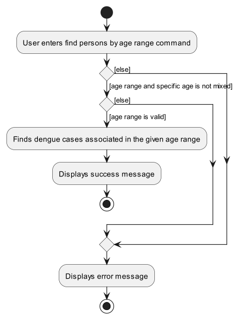

#### Design Considerations

**Aspect: How find-by-range handles invalid ranges (start of a range is after the end of a range)**

* **Alternative 1:** Accepts the user input and executes the find command as per usual, showing success message of zero
cases found.
    * Pros: It is a straightforward approach that requires minimal development effort.
    * Cons: It may confuse users who are not familiar with the range syntax and are unaware that their input is
  invalid and will always show zero cases found. 

* **Alternative 2 (current choice):** Displays a message indicating that the input range is erroneous.
    * Pros: In the case of the user unknowingly making an erroneous input, there would be an indication to the user
  that their input may be unintended.
    * Cons: It is no longer as straightforward in development due to requiring validation checkers for the separate
  date ranges and age ranges.

**Aspect: How find-by-range handles only one of the range prefix of the two are present**

* **Alternative 1 (current choice):** Accepts the user input and executes the find command, finding all cases that
matches after the start of a range if only the start range prefixes are used, or any cases that matches before the end
of a range if only the end range prefixes are used.
    * Pros: It provides more functionality and convenience to the user if they only want to find cases that matches
      after a certain start of a range, or before a certain end of a range.
    * Cons: It may confuse users who are not familiar with the range syntax as it is more difficult to understand that
  the prefixes could be either used simultaneously or individually.

* **Alternative 2:** The range prefixes must come in a pair, displaying a message indicating that the user input is
erroneous otherwise.
    * Pros: It requires minimal development effort, and it is less confusing to the user as fixing range as a pair is
  a simple-to-understand implementation.
    * Cons: The range prefixes are less flexible, and less convenient if the user only wants to find cases that matches
  after a certain start of a range, or before a certain end of a range.

### Sort feature

#### Implementation

The sort mechanism is primarily facilitated by the `DengueHotspotTrackerParser#parseCommand()`, `SortCommandParser#parse()`, and `SortCommand#execute()` methods.

Given below is an example usage scenario and how the sort mechanism behaves at each step.

Step 1. The user launches the application and executes the `sort n/` command to sort the list by name.

Step 2. `DengueHotspotTrackerParser#parseCommand()` parses the command and, detecting the `sort` command word, passes the argument `n/` to the `SortCommandParser`.

Step 3. `SortCommandParser#parse()` is called. Detecting the `n/` argument, it constructs a `SortCommand` with a `PersonNameComparator` and sort type `“NAME”` as arguments. (The equivalents for sorting by age `a/` and date `d/` are the `PersonAgeComparator` and `PersonDateComparator` respectively.)

Step 4. `SortCommand#execute()` will sort a copy of the filtered list `toSort`. `Model#sort(toSort)` will then update the new sorted list in the Model.

The following sequence diagram shows how the sort operation works:

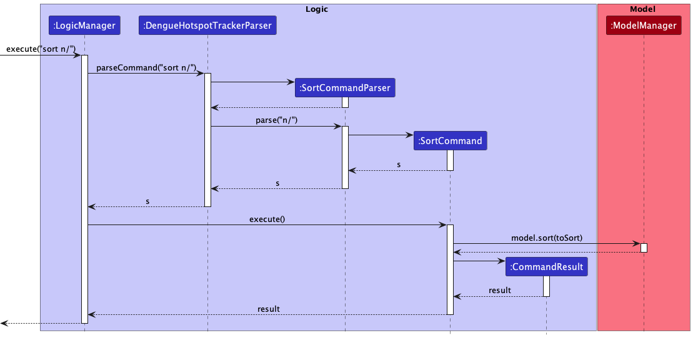

:information_source:
**Note:** Sorting is performed directly on the **entire** list. Sorting is also **permanent**, i.e. it cannot be undone.

### Undo/redo feature

#### Implementation

The undo/redo mechanism is facilitated by `TemporaryMemory`. It extends `SpecialisedStackForMemory`, which implements `StackWithStorage`.
`TemporaryMemory` only stores the 10 most recent actions performed by the user, when the app is open. This means that when the app is closed and open again, the user will not be able to perform an undo or redo.
`TemporaryMemory` can be viewed as a stack which supports additional operations.

1. `TemporaryMemory` only contains 10 saved iterations of the file. Therefore, older iterations are deleted.
2. `TemporaryMemory` supports the redo command, and therefore, after performing an undo, more recent iterations of the file are still stored in an auxiliary storage component.
3. When the user performs an undo and then edits/saves the file once again, more recent iterations of the file must be overwritten. Therefore, this temporary storage is cleared.

`TemporaryMemory`, therefore, is a specialised memory stack, where each item is an iteration of the Dengue Hotspot Tracker file. It holds as attributes a `Deque` for the primary memory stack and an auxiliary storage `Stack`, which temporarily stores popped items (undone operations).

* `TemporaryMemory#saveNewLatest(ReadOnlyDengueHotspotTracker latest)` — Saves the current Dengue Hotspot Tracker state in its history, pushing it into the primary memory stack represented by a `Deque`.
* `TemporaryMemory#undo()` — Restores the previous Dengue Hotspot Tracker state from its history. This pops an item from the primary memory stack represented by a `Deque` and pushes it into the auxiliary storage stack implemented with a `Stack`.
* `TemporaryMemory#redo()` — Restores a previously undone Dengue Hotspot Tracker state from its history. This pushes an item from the auxiliary `Stack` back into the primary memory stack.
* `TemporaryMemory#loadCurrent()` — Peeks into the top element of the stack and loads it.
  These operations are exposed in the `Model` interface as `Model#saveChanges()`, `Model#undo()`, `Model#redo()` and `Model#updateFromMemoryStack()`.
  Given below is an example usage scenario and how the undo/redo mechanism behaves at each step.

Step 1. The user launches the application for the first time. The `DengueHotspotTracker` will be initialized with the initial Dengue Hotspot Tracker state, and the `TemporaryMemory` stack implementation contains only the current Dengue Hotspot Tracker state.

Step 2. The user executes `delete 5` command to delete the fifth case in the Dengue Hotspot Tracker. The `delete` command calls `Model#saveChanges()`. The Dengue Hotspot Tracker is modified, and a copy of the modified Dengue Hotspot Tracker is generated by `DengueHotspotTracker#generateDeepCopy()`. This deep copy is pushed into the `TemporaryMemory` stack under its `Deque`.

Step 3. The user executes `add n/David d/2000 31 January...` to add a new case. The `add` command also calls `Model#saveChanges()`, causing another modified Dengue Hotspot Tracker state to be deep-copied and saved into the `TemporaryMemory` stack, under its `Deque`.

:information_source: **Note:** If a command fails its execution, it will not call `Model#saveChanges()`, so the Dengue Hotspot Tracker state will not be saved into the `TemporaryMemory`.

Step 4. The user now decides that adding the case was a mistake, and decides to undo that action by executing the `undo` command. The `undo` command pops an item from the primary `Deque` in `TemporaryMemory`, and pushes it into the auxiliary storage `Stack`. The new top-level item in the primary `Deque` stack will be read in as the current file.

:information_source: **Note:** If there is only 1 element in the `Deque`, then there are no previous DengueHotspotTracker states to restore. The `undo` command uses `TemporaryMemory#canUndo` to check if this is the case. If so, it will return an error to the user rather
than attempting to perform the undo.

Step 5. The user again decides that adding the case was not a mistake, and decides to redo the action by executing the `redo` command. The `redo` command pops an item from the auxiliary `Stack` in `TemporaryMemory` and pushes it back into the primary stack `Deque`, where it is being read as the current file.

Step 6. The user now wishes to perform an undo ten times. The user executes the `undo 10` command to undo ten steps. However, only two iterations of the tracker data are popped from the `TemporaryMemory` primary `Deque` and pushed into the auxiliary `Stack`. Because only three `DengueHotspotTracker` states exist, only two undos are possible.

The following activity and sequence diagrams shows how the undo operation works:

:information_source: **Note:** The lifeline for `UndoCommand` should end at the destroy marker (X) but due to a limitation of PlantUML, the lifeline reaches the end of diagram.

The `redo` command does the opposite — it calls `TemporaryMemory#redo()`, which pops from the auxiliary `Stack` once, and pushes the popped item back into the primary `Deque`, restoring the Dengue Hotspot Tracker to a previous state.

Step 7. The user then decides to execute the command `list`. Commands that do not modify the Dengue Hotspot Tracker, such as `list`, will usually not call `Model#saveChanges()`. Thus `Model#undo()` or `Model#redo()` will ignore this command. Thus, the `TemporaryMemory` remains unchanged.

The following activity diagram summarizes what happens when a user executes a new command:

#### Design considerations

**Aspect: How undo & redo executes**

* **Alternative 1 (current choice):** Saves 10 previous iterations of the entire dengue case list temporarily while the app is running.
    * Pros: Saves memory as all tracker iterations are deleted when the app closes. Deleting older tracker iterations also helps to improve performance.
    * Cons: User may not have access to older data.

* **Alternative 2:** Saves 10 previous iterations of the entire dengue case list in a JSON file.
    * Pros: User can have direct access to older data.
    * Cons: Can be very messy to implement.

**Aspect: Support switching of `DengueHotspotTracker` states in undo/redo**

* **Alternative 1 (current choice):** Modified stack consisting of Deque and Stack.
    * Pros: `Stack` and `ArrayDeque` are classes that are already implemented in Java. Easy to create.
    * Cons: Not easy to come up with solution.

* **Alternative 2:** List of `DengueHotspotTracker` states, with pointers to support switching of states.
    * Pros: Very intuitive and easy to think of.
    * Cons: Not easy to implement, and keeping tracker of list indices may cause bugs.

**Aspect: Support deletion of old `DengueHotspotTracker` states in undo/redo**

* **Alternative 1 (current choice):** Modified stack consisting of Deque and Stack.
    * Pros: `Stack` and `ArrayDeque` can already be used.
    * Cons: None

* **Alternative 2:** List of DengueHotspotTracker states, with pointers to support switching of states.
    * Pros: Solution is easy.
    * Cons: Potentially buggy.

### Overview feature

#### Implementation

Step 1. placeholder

#### Design considerations

**Aspect: xxx**

* **Alternative 1 (current choice):** placeholder
    * Pros: placeholder
    * Cons: placeholder

* **Alternative 2:** placeholder
    * Pros: placeholder
    * Cons: placeholder

### Import feature

#### Implementation

The import mechanism is primarily facilitated by the `DengueHotspotTrackerParser#parseCommand()`,
`ImportCommandParser#parse()`, `ImportCommand#execute()` and
`CsvDengueHotspotStorage#readDengueHotspotStorage()` methods.

Given below is an example usage scenario and how the import csv mechanism behaves at each step.

Step 1. The user launches the application.

Step 2. The user executes the `import sampledata.csv` command to import a list of cases from `sampledata.csv`.
`DengueHotspotTrackerParser#parseCommand()` parses the command and, detecting the `import` command word,
passes the argument `sampledata.csv` to the `importCommandParser`.

Step 3. `ImportCommandParser#parse()` is called. It checks that `sampledata.csv` does not contain any special characters,
and that it ends with `.csv`. An `ImportCommand` is constructed, taking in the trimmed filepath `sampledata.csv` as an argument.

Step 4. `ImportCommand#execute()` will get the trimmed filepath and retrieve the list of cases to import from `sampledata.csv`.

Step 5. A `CsvDengueHotspotStorage` is created and `CsvDengueHotspotStorage#readDengueHotspotStorage()` is called,
importing the valid case list if the format is valid.

The following sequence diagram shows how the import command works:

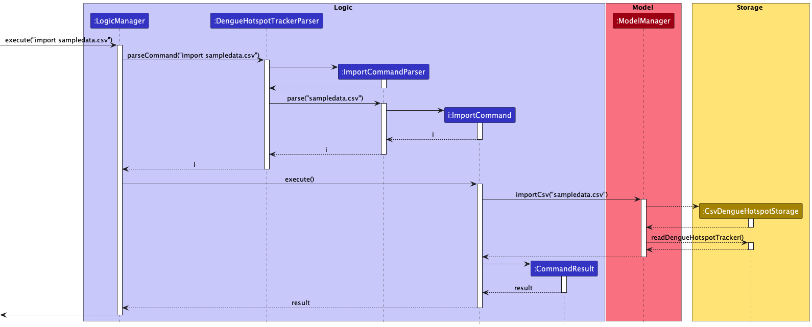

The following activity diagram summarises what happens when a user executes an import command:

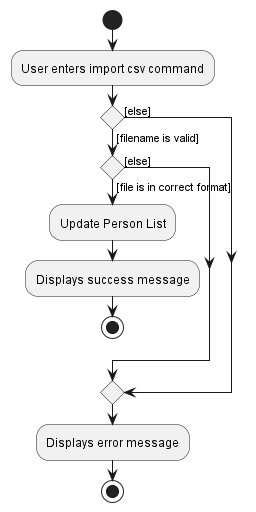

#### Design Considerations

**Aspect: What filenames and directories accepted**

* **Alternative 1 (current choice):** Accept only filenames without special characters and are contained within the
same directory. This is done by checking the inputted filename ends with .csv and does not contain non-alphanumeric
characters.
    * Pros: This makes storage of the files easy and it is easy to validate the filename.
    * Cons: Less flexibility in where the user can import their files from. It is limited to the same
      directory.
      * We also do not currently accept additional directory specifications and files must be imported from the same
      directory as `dht.jar`.

* **Alternative 2:** Allows a wider range of filename inputs including subdirectories.
    * Pros: More flexibility as to where the user can import their files from.
    * Cons: Harder to implement. Refer to planned enhancements.

### Export feature

#### Implementation

The feature is largely similar to the [import](#import-feature) up to step 4.

Step 5. A `CsvDengueHotspotStorage` is created and `CsvDengueHotspotStorage#saveDengueHotspotStorage()` is called,
saving the csv to `sampledata.csv`.

The following sequence diagram represents the difference in step 5:

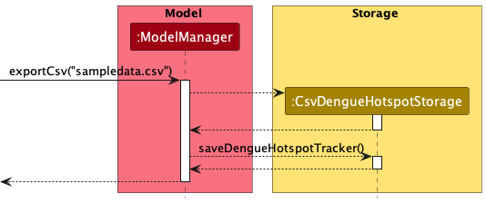

The following activity diagram summarises what happens when a user executes an export command:

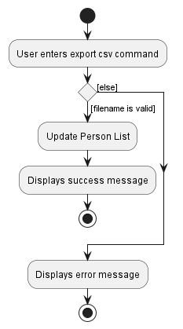

#### Design considerations

**Aspect: What filenames and directories accepted**

Same as import command design considerations for what filenames are accepted.

**Aspect: Overwrite checking**

* **Alternative 1 (current choice):** We currently allow the user to overwrite CSV files stored as long as the IO operations are successful.
    * Cons: This is an issue as a user can accidentally override important CSV files.
    * Pros: It is easier to implement.

* **Alternative 2:**
    * Pros: Adds an additional layer of check so that the user does not override previously stored CSV files.
    * Cons: Harder to implement. Look at future work.

### Checkout feature

This feature is largely similar to the [export](#export-feature) up to step 4.

Step 5: Model calls `Overview#getOverviewContent()` to obtain the list to export to CSV.

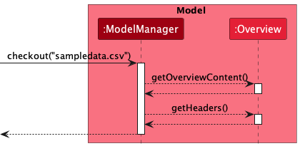

The activity diagram is similar to that of the `export` command.

#### Design considerations

The design considerations and future are the same of that as [export](#export-feature)

--------------------------------------------------------------------------------------------------------------------

## **Documentation, logging, testing, configuration, dev-ops**

* [Documentation guide](Documentation.md)
* [Testing guide](Testing.md)
* [Logging guide](Logging.md)
* [Configuration guide](Configuration.md)
* [DevOps guide](DevOps.md)

--------------------------------------------------------------------------------------------------------------------

## **Appendix: Requirements**

### Product scope

**Target user profile**:

* NEA personnel in charge of delegating personnel to dengue hotspots in order to mitigate the spread of dengue via pest control
* has some mastery over using a computer
* prefers typing to other means of input

**Value proposition**: Inefficient allocation of pest control resources will cost excess time and money. This app will help optimise resources by tracking dengue cases, classifying them by neighbourhood, and identifying clusters.

### User stories

Priorities: High (must have) - `* * *`, Medium (nice to have) - `* *`, Low (unlikely to have) - `*`

| Priority | As a …​       | I want to …​                                                            | So that I can…​                                                           |
|----------|---------------|-------------------------------------------------------------------------|---------------------------------------------------------------------------|
| `* * *`  | new user      | easily view a help page                                                 | know how to use the app                                                   |
| `* * *`  | new user      | list all dengue cases                                                   | have a high-level overview of the cases                                   |
| `* * *`  | user          | add a new dengue case                                                   | keep track of the dengue cases in Singapore                               |
| `* * *`  | user          | delete cases from the dengue case list by index                         | remove cases that I no longer need                                        |
| `* * *`  | user          | delete multiple cases from the dengue case list by index at once        | remove multiple cases that I no longer need at once                       |
| `* * *`  | user          | delete multiple cases from the dengue case list by date at once         | remove multiple cases that I no longer need at once                       |
| `* * *`  | user          | delete multiple cases from the dengue case list by date range at once   | remove multiple cases that I no longer need at once                       |
| `* * *`  | user          | find dengue cases by name                                               | locate details of cases without having to go through the entire list      |
| `* * *`  | user          | find dengue cases by age                                                | locate details of cases without having to go through the entire list      |
| `* * *`  | user          | find dengue cases by age range                                          | locate details of cases without having to go through the entire list      |
| `* * *`  | user          | find dengue cases by the starting digits of their postal code           | locate details of cases without having to go through the entire list      |
| `* * *`  | user          | find dengue cases by date                                               | locate details of cases without having to go through the entire list      |
| `* * *`  | user          | find dengue cases by date range                                         | locate details of cases without having to go through the entire list      |
| `* * *`  | user          | find dengue cases by variant                                            | locate details of cases without having to go through the entire list      |
| `* * *`  | user          | automatically save the list of cases upon exit                          | reload them again the next time I open the app                            |
| `* *`    | careless user | undo an action                                                          | undo my mistakes                                                          |
| `* *`    | careless user | redo an action                                                          | redo an action that I mistakenly thought was a mistake                    |
| `* *`    | user          | edit a dengue case                                                      | correct mistakes in case details                                          |
| `* *`    | user          | sort dengue cases by name                                               | get an ordered view of the cases                                          |
| `* *`    | user          | sort dengue cases by age                                                | get an ordered view of the cases                                          |
| `* *`    | user          | sort dengue cases by postal code                                        | get an ordered view of the cases                                          |
| `* *`    | user          | sort dengue cases by date                                               | get an ordered view of the cases                                          |
| `* *`    | user          | get an overview of the cases by postal code                             | have an overview of the geographical location of the cases                |
| `* *`    | user          | get an overview of the cases by age                                     | have an overview of the age distribution of the cases                     |
| `* *`    | user          | get an overview of the cases by variant                                 | have an overview of the variant distribution of the cases                 |
| `* *`    | user          | export the data from the dengue case list from a database in a CSV file | analyse the data outside of the app or share it with non-users of the app |
| `* *`    | new user      | clear all entries                                                       | start over with an empty data set                                         |

### Use cases

(For all use cases below, the **System** is the `DengueHotspotTracker` and the **Actor** is the `user`, unless specified otherwise)

#### Use case: Add a case

**MSS**

1. User requests to add a case
2. DengueHotspotTracker adds the case

    Use case ends.

**Extensions**

* 1a. The case to be added is missing a required field, or has invalid input for a field.
  * 1a1. DengueHotspotTracker shows an error message.
      Use case resumes at step 1.

* 1a. The proposed case to be added results in a duplicate case.
    * 1a1. DengueHotspotTracker shows an error message.
      Use case resumes at step 1.

#### Use case: Edit a case

**MSS**

1.  User requests to list cases
2.  DengueHotspotTracker shows a list of cases
3.  User requests to edit a case at a particular index in the list
4.  DengueHotspotTracker edits the case

   Use case ends.

**Extensions**

* 2a. The list is empty.
  Use case ends.

* 3a. The given index is invalid.
    * 3a1. DengueHotspotTracker shows an error message.
      Use case resumes at step 2.

* 3a. The user does not provide a field to edit.
    * 3a1. DengueHotspotTracker shows an error message.
      Use case resumes at step 2.

* 3a. The proposed edit results in a duplicate case.
    * 3a1. DengueHotspotTracker shows an error message.
      Use case resumes at step 2.

#### Use case: Delete a single case by index

**MSS**

1.  User requests to list cases
2.  DengueHotspotTracker shows a list of cases
3.  User requests to delete a single case by index in the list
4.  DengueHotspotTracker deletes the case

    Use case ends.

**Extensions**

* 2a. The list is empty.

  Use case ends.

* 3a. The given index is invalid.

    * 3a1. DengueHotspotTracker shows an error message.

      Use case resumes at step 2.

#### Use case: Delete multiple cases by index

**MSS**

1.  User requests to list cases
2.  DengueHotspotTracker shows a list of cases
3.  User requests to delete multiple cases by index in the list
4.  DengueHotspotTracker deletes cases

    Use case ends.

**Extensions**

* 2a. The list is empty.
  Use case ends.

* 3a. Any of the given indexes are invalid.
    * 3a1. DengueHotspotTracker shows an error message.
      Use case resumes at step 2.

#### Use case: Delete multiple cases by date

**MSS**

1.  User requests to list cases
2.  DengueHotspotTracker shows a list of cases
3.  User requests to delete multiple cases by date in the list
4.  DengueHotspotTracker deletes cases

    Use case ends.

**Extensions**

* 2a. The list is empty.
  Use case ends.

* 3a. The given date is invalid.
    * 3a1. DengueHotspotTracker shows an error message.
      Use case resumes at step 2.

#### Use case: Delete multiple cases by date range

**MSS**

1.  User requests to list cases
2.  DengueHotspotTracker shows a list of cases
3.  User requests to delete multiple cases by date range in the list
4.  DengueHotspotTracker deletes cases

    Use case ends.

**Extensions**

* 2a. The list is empty.
  Use case ends.

* 3a. The given date range is invalid.
    * 3a1. DengueHotspotTracker shows an error message.
      Use case resumes at step 2.

#### Use case: Find cases by name

**MSS**

1.  User requests to list cases
2.  DengueHotspotTracker shows a list of cases
3.  User requests to find cases by name in the list
4.  DengueHotspotTracker finds cases

    Use case ends.

**Extensions**

* 2a. The list is empty.
  Use case ends.

* 3a. The given name is invalid.
    * 3a1. DengueHotspotTracker shows an error message.
      Use case resumes at step 2.

#### Use case: Find cases by age range

**MSS**

1.  User requests to list cases
2.  DengueHotspotTracker shows a list of cases
3.  User requests to find cases by age range in the list
4.  DengueHotspotTracker finds cases

    Use case ends.

**Extensions**

* 2a. The list is empty.
  Use case ends.

* 3a. The given age range is invalid.
    * 3a1. DengueHotspotTracker shows an error message.
      Use case resumes at step 2.

#### Use case: Find cases by name, age and date range

**MSS**

1.  User requests to list cases
2.  DengueHotspotTracker shows a list of cases
3.  User requests to find cases by name, age and date range in the list
4.  DengueHotspotTracker finds cases

    Use case ends.

**Extensions**

* 2a. The list is empty.
  Use case ends.

* 3a. The given name, age or date range is invalid.
    * 3a1. DengueHotspotTracker shows an error message.
      Use case resumes at step 2.

#### Use case: Sort the case list

**MSS**

1.  User requests to list cases
2.  DengueHotspotTracker shows a list of cases
3.  User requests to sort the list by a given criterion
4.  DengueHotspotTracker sorts the list by the given criterion

    Use case ends.

**Extensions**

* 2a. The list is empty.

  Use case ends.

* 3a. The given criterion is invalid.

    * 3a1. DengueHotspotTracker shows an error message.

      Use case resumes at step 2.

#### Use case: Undo an action

**MSS**

1. User requests to undo one action by executing `undo`. 
2. DengueHotspotTracker is restored to a state before step 1, performing an undo operation a certain number of times, according to the specified argument.
3. A list of persons is reflecting the previous state is displayed.

**Extensions**

* 1a. An invalid argument is supplied.

    * 1a1. DengueHotspotTracker shows an error message.

    Use case ends.

* 1b. No previous states are detected, and an undo is not possible.

    * 1b1. DengueHotspotTracker shows an error message.

    Use case ends.

* 1c. There is no argument supplied.

    Use case resumes at step 2 with argument set to 1.

* 1d. The argument specified is a positive integer, and at least 1 previous state is detected, but there are not enough previous states available.

    Use case resumes at step 2 with argument set to the maximum number of possible undo operations possible.

* 2a. The DengueHotspotTracker is displaying a filtered list instead of the full list of cases.

    * 2a1. DengueHotspotTracker reverts to showing the complete list.

    Use case resumes at step 3.

#### Use case: Import data

**MSS**

1. User requests to import list of cases from filepath
2. DengueHotspotTracker updates case list with new list of cases

   Use case ends.

**Extensions**

* 1a. The filepath is invalid
    * 1a1. DengueHotspotTracker shows an error message. Use case resumes at step 1.

* 1a. The filepath contains an empty file or a file in an incorrect format
    * 1a1. DengueHotspotTracker shows an error message. Use case resumes at step 1.

#### Use case: Export/checkout data

**MSS**

1.  User requests to list cases
2.  DengueHotspotTracker shows a list of cases
3.  User requests to export list of cases or checkout overview

    Use case ends.

**Extensions**

* 1a. The filepath is invalid
    * 1a1. DengueHotspotTracker shows an error message. Use case resumes at step 2.

* 1a. The file at given filepath is used by another application
    * 1a1. DengueHotspotTracker shows an error message. Use case resumes at step 2.

### Non-Functional Requirements

1.  Should work on any _mainstream OS_ as long as it has Java `11` or above installed.
2.  Should be able to hold up to 1000 dengue cases without a noticeable sluggishness in performance for typical usage.
3.  A user with above average typing speed for regular English text (i.e. not code, not system admin commands) should be able to accomplish most of the tasks faster using commands than using the mouse.

*{More to be added}*

### Glossary

* **Mainstream OS**: Windows, Linux, Unix, OS-X
* **Case**: A person who has contracted Dengue fever.
  * Can be used interchangeably with **Person**.
* **CSV file**: Comma-separated values file

--------------------------------------------------------------------------------------------------------------------

## **Appendix: Instructions for manual testing**

Given below are instructions to test the app manually.

:information_source: **Note:** These instructions only provide a starting point for testers to work on;
testers are expected to do more *exploratory* testing.

### Launch and shutdown

1. Initial launch

    1. Download the jar file and copy into an empty folder

    1. Double-click the jar file Expected: Shows the GUI with a set of sample contacts. The window size may not be optimum.

1. Saving window preferences

    1. Resize the window to an optimum size. Move the window to a different location. Close the window.

    1. Re-launch the app by double-clicking the jar file. 
       Expected: The most recent window size and location is retained.

### Deleting cases

1. Deleting a single case while all cases are being shown
    1. Prerequisites: List all cases using the `list` command. Multiple cases in the list.
    1. Test case: `delete 1` 
       Expected: First case is deleted from the list. Details of the deleted contact shown in the status message.
    1. Test case: `delete 0` 
       Expected: No case is deleted. Error details shown in the status message.
    1. Other incorrect single-index delete commands to try: `delete`, `delete x`, `...` (where x is larger than the list size) 
       Expected: Similar to previous.
2. Deleting multiple cases while all cases are being shown
   2. Prerequisites: List all cases using the `list` command. Multiple cases in the list.
   2. Test case: `delete 1 2` 
      Expected: First and second cases are deleted from the list. Number of cases deleted shown in the status message.
   2. Test case: `delete 0 1`  
      Expected: No case is deleted as at least one of the given indexes is out of range. Error details shown in the status message.

### Exporting/Importing data

1. Testing import CSV
   1. Remove `denguehotspottracker.csv` file in the /data folder.
   1. Run `DengueHotSpotTracker` to obtain an initialized list of cases.
   1. Enter Command: `export sampledata.csv` to export existing list of cases. 
      Expected: Successfully exported data to sampledata.csv
   1. Enter Command: `clear` to clear existing list of cases.
   1. Enter Command: `import sampledata.csv` to import sampledata.csv. 
      Expected: Successfully imported data from sampledata.csv

### Saving data

1. Dealing with missing/corrupted data files
   1. Ensure that `DengueHotspotTracker` is currently not running.
   1. Open `data/denguehotspottracker.csv` file with your favourite text editor.
   1. Remove any of the quotation marks.
   1.Run `DengueHotspotTracker`. Since the data file is not in the correct format, `DengueHotspotTracker` should start without any data.

--------------------------------------------------------------------------------------------------------------------

## **Appendix: Effort**

Our group found the project somewhat challenging despite being familiar with one another’s working styles beforehand
and putting in significant effort into planning. Besides good ol’ merge conflicts, we also faced disagreements over
what features to add and how to implement each of them. For instance, some of us had differing opinions on the value
that certain features would bring to users, as well as the level of abstraction to achieve when implementing new features.
Another challenge we faced was over- or underestimating the amount of effort required to implement certain features,
leading to a slight imbalance in workload. Although we believe we have put in an average level of effort compared to
other groups, one of our previous lectures did suggest that most groups tended to stretch themselves too much,
going far beyond what was required.

Nevertheless, we found working on this software engineering project a gratifying and fulfilling experience.
It was all our first times working on and collaborating with others on a large-scale code base. Those of us who were
more experienced with GitHub, good code quality, etc. were able to share their expertise and still gain new insights
from the less experienced members of the team. Each of us improved our software engineering skills: we learnt how
to build good, maintainable software, and gained experience in both manual and automated testing.

Some more specific achievements include producing a product that was more complex than AB3 due to our enhanced
input validation. For instance, postal codes have to begin with a valid two-digit postal sector, both age and
date ranges have to be valid, and multiple date formats are accepted. We also greatly enhanced the UI of the
product, enhancing the visual experience for users.

--------------------------------------------------------------------------------------------------------------------

## **Appendix: Planned Enhancements**

### Standardising terminology

DengueHotspotTracker currently alternates between using "case" or "person" to refer to each entry in the app.
Standardising terminology would clean up the app and reduce any potential confusion for users and developers.

### Sorting by descending order

The sort command currently only allows users to sort in ascending order. Users might find it more useful in some cases to
sort by descending order instead, e.g. if they wish to examine the most recent cases, or find the cases with the highest ages.
We plan to add the ability to sort by descending order to make the app more useful for our users.

### Wrapping longer names for better readability

Currently, longer names will be truncated; to see the full name, the user needs to manually resize the app window. To
reduce inconvenience on users, we plan to add text wrapping so that longer names can still be fully read without the user
having to manually adjust the window size.

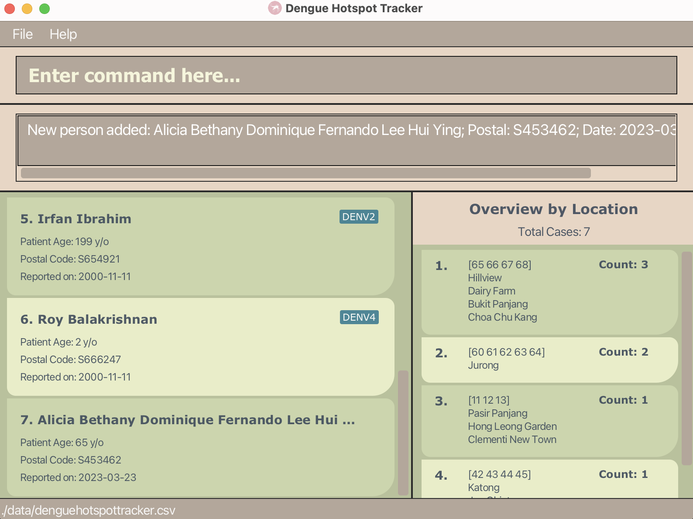

### Standardising success messages

Although both the `find` and `delete` commands can filter the case list by date and date range, their success messages differ:
the `find` command merely states the number of cases found, while the `delete` command further clarifies the date or date range
within which the cases were found:

 

While minor, the discrepancy may cause confusion to users. We plan to standardise the
success message, mentioning in both cases the date or date range within which the cases were found for greater clarity.

### Do an existence check on the files before export

We will implement a checker that will prompt the user asking if they're sure they want to override the CSV file
currently at the filename location.

We did not implement this due to the difficulty as well as not having thought about it prior to `v1.3`.

### Check the validity of filenames which include subdirectories

This feature helpful as described under export command's design considerations. However, this is an additional feature
and we were not able to add it into `v1.4`.

This is a very helpful feature since it prevents accidental mistakes of overwriting preexisting CSV files.
