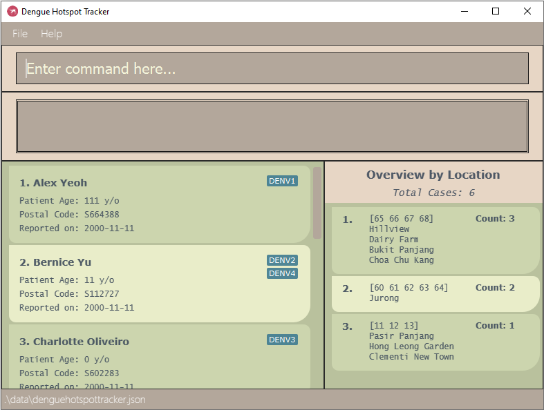
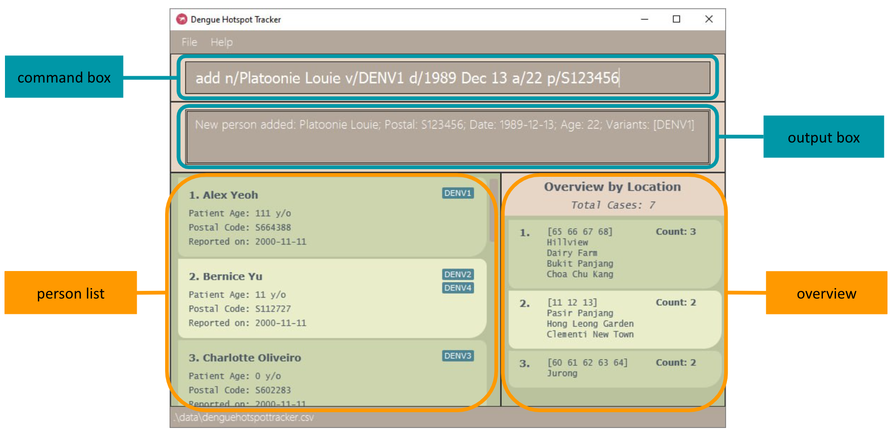
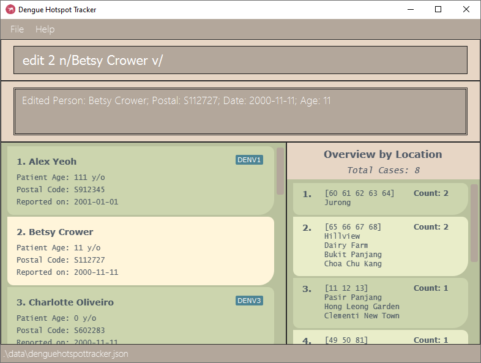
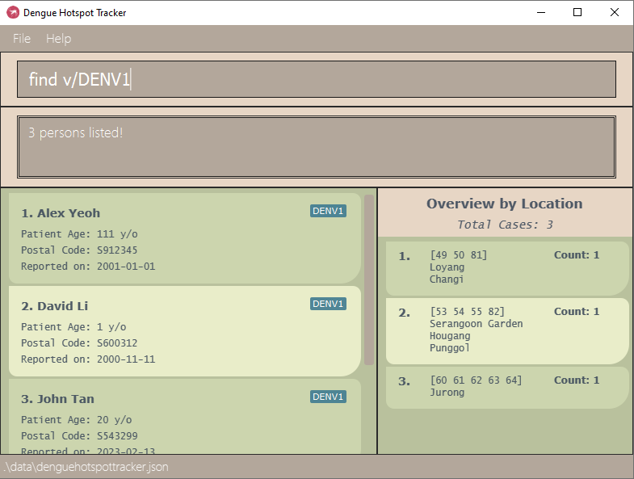
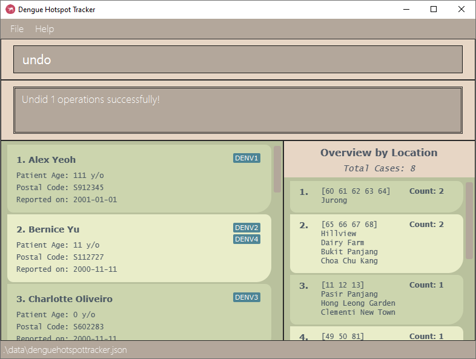

* Table of Contents
{:toc}

--------------------------------------------------------------------------------------------------------------------

## Introduction

DengueHotspotTracker (DHT) is a **desktop app for managing dengue cases, optimised for**
**use via a Command Line Interface** (CLI) while still having the benefits of a Graphical User
Interface (GUI). If you can type fast, DHT can get your dengue case management tasks done faster
than traditional GUI apps.

### Purpose of this application

Dengue fever is a prevalent mosquito-borne disease in many parts of the world, including Singapore.
The National Environmental Agency (NEA) of Singapore is responsible for monitoring and controlling the spread of this disease.
To aid in this task, a new application called DengueHotspotTracker (DHT) has been developed, which allows NEA to track all reported cases of dengue fever in Singapore.

This application serves as a case tracker, containing the name, postal code, age, date, and (optional) variant type
of the reported case. The user-friendly interface provides an easy-to-view overview of the cases, enabling NEA to
monitor the trends of the disease in different areas, spread in different age groups, and spread of
different variant types of dengue. Overall, this application would allow NEA to stay informed about the latest trends
and take proactive measures to prevent the spread of the disease.

### Purpose of this guide
This guide will introduce you to the various features offered by DengueHotspotTracker.
Use this guide as a tutorial to get started with DengueHotspotTracker.

This guide is:
* A summary of all the *features* offered by DengueHotspotTracker, and provides a high-level overview on how it operates.
* An overview of what user *input* is considered as valid so you can quickly get started with tracing cases on DengueHotspotTracker.

This guide is not:
* An exhaustive case study of every single way to use DengueHotspotTracker as well as its features.

--------------------------------------------------------------------------------------------------------------------

## How to use this guide

Thank you for taking your time to learn how to use DengueHotspotTracker!

Here are some tips on how to look through this guide more effectively and efficiently,
so you can improve your knowledge on the use of DengueHotspotTracker.

### Navigating the guide

1. First, you can read the [Quick Start](#quick-start) section to ensure that your system is compatible with DengueHotspotTracker.
We recommend that you follow along the instructions to download and use DengueHotspotTracker with the commands introduced in this guide.
2. Do have a glance at [Conventions](#conventions) to understand the symbols and formatting used across this guide.
3. Now that you have had an initial look at DengueHotspotTracker, we have a detailed listing of how to understand the user interface [here](#navigating-the-user-interface).
4. Now that you understand how to use the interface of DengueHotspotTracker, you are ready to take a deeper dive into our commands.
We have some general guidelines on what user input is considered as valid. You should refer to [commands](#commands) to get a detailed coverage of the available commands.

### Conventions

Symbols | Meaning
--------|------------------
:information_source: | This is general information that improves your background understanding of this guide as well as DengueHotspotTracker.
:bulb: | This is additional information/tips that may help you to use DengueHotspotTracker more effectively.
:exclamation: | This is something important that you should be aware of.

Formatting | Meaning
--------|------------------
*italics* | This is used to give slight emphasis to certain words.
**boldface** | This is used to emphasise certain words. The degree of emphasis is stronger than *italics*.
`code` | This is used to denote user input or special text.

## Quick Start

1. Ensure you have Java `11` installed on your Computer.

2. Download the latest `dht.jar` from [here](https://github.com/AY2223S2-CS2103-W17-2/tp/releases).

3. Copy the file to the folder you want to use as the home folder for your DengueHotspotTracker.

4. Open a command terminal, `cd` into the folder you put the jar file in, and use the `java -jar dht.jar` command to run
the application. 

   A GUI similar to the following image should appear in a few seconds. Note how the app contains some sample data.  
     

5. Type the command in the command box and press Enter to execute it. e.g. typing **`help`** and pressing Enter will
open the help window. 
   Some example commands you can try:

   * `list`: Lists all cases.

   * `add n/John Tan p/543299 d/2023 February 13 a/20`: Adds a case named `John Tan` to DengueHotspotTracker.

   * `delete 3`: Deletes the third case shown in the current list.

   * `find n/John`: Finds all cases whose name contains `John` (non-case sensitive) and shows it in a filtered list.

   * `clear`: Deletes all cases shown in the current list.

   * `exit`: Exits the app.

   * `undo 5`: Undoes up to five actions.

   * `redo 5`: Redoes up to five actions.

6. To learn more about DengueHotspotTracker, refer to the [Commands](#Commands) section below for details of each command, or the [Command Summary](#Command-summary).

--------------------------------------------------------------------------------------------------------------------

## Navigating the User Interface

The user interface is split into the input and output sections, as well as
two view columns for **Person List** and **Overview**.

Item | Description
--------|------------------
**command box** | This is where you enter your commands to DengueHotspotTracker.
**output box** | The output box displays additional information from a command.   :bulb: For a *successful* command, the output box may contain information such as the number of entries listed.   :bulb: For an *unsuccessful* command, such as invalid input, the output box will give detailed feedback about which part of the command is invalid and how to fix it.
**person list** | A list of people and their details.
**overview** | Provides an overview of the total number of cases and cases per category.

Here is the breakdown of an individual **person card**.

Item | Description
--------|------------------
**id** | Current index of the person in the list.
**Name** | Name of person who got dengue.
**Age** | Age of the person who got dengue.
**Postal** | Postal code of the person who got dengue.
**Date** | Date that the person got dengue.
**Variant** | Dengue variant of the case (DENV1, DENV2, DENV3, or DENV4).

Here is the breakdown of an individual **bin card**.

Item | Description
--------|------------------
**id** | Index in the overview list.
**Overview Category** | Overview category currently being displayed.    :bulb: The default overview category is by location.
**Bin Name** | Bin that cases belong to in the chosen category.
**Count** | The number of cases on the displayed list belonging to the bin.

--------------------------------------------------------------------------------------------------------------------

## Command summary
Please refer to the commands for a full explanation.

| Action       | Format, Examples                                                                                                                                                                                                       |
|--------------|------------------------------------------------------------------------------------------------------------------------------------------------------------------------------------------------------------------------|
| **Add**      | `add n/NAME a/AGE p/POSTAL d/DATE [v/VARIANT]...`  e.g. `add n/James Ho a/23 p/S222244 d/2000-11-11 v/DENV1`                                                                                                        |
| **Edit**     | `edit INDEX [n/NAME] [a/AGE] [p/POSTAL] [d/DATE] [v/VARIANT]...`  e.g.`edit 2 n/James Lee d/2001-11-11`                                                                                                             |
| **Delete**   | `delete INDEX...` or <code>delete d/DATE</code> or <code>delete [sd/START_DATE] [ed/END_DATE] (at least 1)</code>  e.g. `delete 3`, `delete d/2023-03-10`                                                           |
| **Clear**    | `clear`                                                                                                                                                                                                                |
| **List**     | `list`                                                                                                                                                                                                                 |
| **Find**     | <code>find [n/NAME] [p/POSTAL] [v/VARIANT]... [a/AGE] [d/DATE] (at least 1, a/ and d/ tags can be replaced by sa/,ea/ or sd/,ed/ tags)</code>  e.g. `find n/James Jake`, `find sa/20 ea/29`, `find v/DENV1 v/DENV2` |
| **Sort**     | <code>sort { n/ &#124; a/ &#124; d/ }</code>  e.g.`sort d/`                                                                                                                                                         |
| **Undo**     | `undo [INTEGER]`  e.g. `undo 5`                                                                                                                                                                                     |
| **Redo**     | `redo [INTEGER]`  e.g. `redo 2`                                                                                                                                                                                     |
| **Overview** | <code>overview { p/ &#124; a/ &#124; v/ }</code>  e.g. `overview v/`                                                                                                                                                |
| **Checkout** | `checkout [FILENAME]`  e.g. `checkout overview.csv`                                                                                                                                                                 |
| **Import**   | `import [FILENAME]`  e.g. `import sampledata.csv`                                                                                                                                                                   |
| **Export**   | `export [FILENAME]`  e.g. `export sampledata.csv`                                                                                                                                                                   |
| **Help**     | `help`                                                                                                                                                                                                                 |
| **Exit**     | `exit`                                                                                                                                                                                                                 |

--------------------------------------------------------------------------------------------------------------------

## Command Syntax Guide

This section helps you to understand the format of the commands listed above and in the [command section](#commands).

**:information_source: Notes about the command format:** 

* Words in `UPPER_CASE` are the parameters to be supplied by the user. 
  e.g. in `add n/NAME`, `NAME` is a parameter which can be used as `add n/John Doe`.

* Parameters with prefixes can be in any order. 
  e.g. if the command specifies `n/NAME p/POSTAL`, `p/POSTAL n/NAME` is also acceptable.

* If a parameter is expected only once in the command but was specified multiple times,
  only the last occurrence of the parameter will be taken. 
  e.g. if `p/123414 p/567878` was given, only `p/567878` will be parsed.

* Extraneous parameters for commands that do not take in parameters (e.g. `clear`, `list`, `help` and `exit`) will be ignored. 
  e.g. if the command `help 123` was given, it will be interpreted as `help`.

* If an input contains unnecessary whitespaces at its start or end, they will be trimmed first.
  The input will be read in without these whitespaces.

* Items in square brackets are optional. 
  e.g. `n/NAME [v/VARIANT]` can be used as `n/John Doe v/DENV1` or as `n/John Doe`.

* Items in curly brackets `{ }` separated by vertical lines `|` form a set from which one option is to be chosen. 
  e.g. `{ p/ | a/ | v/ }` means that exactly one of `p/`, `a/` and `v/` must be chosen.

* Items with `...` after them can be used multiple times, including zero times. 
  e.g. `[v/VARIANT]...` can be used as ` ` (i.e. 0 times), `v/DENV1`, `v/DENV1 v/DENV2`, etc.

--------------------------------------------------------------------------------------------------------------------

## Valid data field inputs
This section describes the requirements of the specified data fields.
Aside from Variants, data fields must contain at least one non-whitespace character (i.e. blank inputs are not accepted).

### Name
* Names must only contain letters and spaces.
* Longer names may be truncated. To see the full text, resize the app window.

### Postal code
* Postal codes must be in one of the following formats:
    * S123456
    * s123456
    * 123456
* Postal codes must have six digits.
* The first two digits of a postal code must correspond to a valid postal sector in Singapore.
  Valid postal sectors consist of numbers 01–73 inclusive, 75–82 inclusive, and 91.

### Date
* Dates must contain a year, a month, and a day.
* Multiple date formats are accepted, as long as `yyyy`, `MM`/`MMM`/`MMMM` and `dd` are present,
  with no extra alphanumeric characters.
* Dates must be in one of the following formats:
  * Year:
    * 4-digit years `YYYY`
  * Month:
    * 2-digit months `MM`
    * 3-letter months `MMM`
    * Fully-spelled months `MMMM`
  * Day:
    * 2-digit days `dd`
  * When it is ambiguous whether a sequence of digits corresponds to `MM`, `dd`, or `yyyy`,
    the first sequence of four digits will be read as `yyyy`, the first sequence of two digits
    as `MM`, and the last sequence of two digits as `dd`. Thus, `20000102` is read as 2nd January 2000.

### Age
* Ages should only contain numeric characters.
* Ages should be between 0 and 199 inclusive.
    * Valid:
        * `0`
        * `51`
        * `199`
    * Invalid:
        * `#20` (contains invalid hash symbol)
        * `200` (outside of the range of valid ages)

### Variants
* Variants must be one of the following four values:
  * `DENV1`
  * `DENV2`
  * `DENV3`
  * `DENV4`

### Indexes
* Indexes must be a positive integer. Index values can be up to ~2 billion, specifically 2147483647.
* Index will always refer to the index number shown in the current displayed case list.

--------------------------------------------------------------------------------------------------------------------

## Commands

### Adding a case: `add`

Adds a dengue patient to DengueHotspotTracker.

Format: `add n/NAME a/AGE p/POSTAL d/DATE [v/VARIANT]...`

Examples:
* `add n/John Tan p/543299 d/2023-02-13 a/20 v/DENV1` 
  adds a case with the name `John Tan`, postal code `543299`, date `2023-02-13`,
  age `20`, and variant `DENV1` into DengueHotSpotTracker.
* `add n/Desiree Lim p/519999 d/2023-02-13 a/18`
  adds a case with the name `Desiree Lim`, postal code `519999`, date `2023-02-13`,
  and age `18` into DengueHotSpotTracker.
* If a case with the same name, postal code, and age already exists in the DengueHotspotTracker,
  it cannot be added again.

 

### Editing a case: `edit`

Edits an existing case in DengueHotspotTracker.

Format: `edit INDEX [n/NAME] [a/AGE] [p/POSTAL] [d/DATE] [v/VARIANT]...`

* Edits the case at the specified `INDEX`.
* At least one of the optional fields must be provided.
* Existing values will be updated to the input values.
* When editing dengue variants, all existing variants of the case will be removed, i.e. adding of variants is not cumulative.
* You can remove all the case’s dengue variants by typing `v/` without
  specifying any variants after it.
* Cases cannot be edited to have the same name, postal code, and age
  as another case already in DengueHotspotTracker.

Examples:
* `edit 1 p/912345 d/2001-01-01` edits the postal code and date of the first case to be `S912345` and `2001-01-01`
  respectively.

* `edit 2 n/Betsy Crower v/` edits the name of the second case to be `Betsy Crower` and clears all variants tagged to that case.

 

### Deleting cases: `delete`

Deletes the specified case(s) from DengueHotspotTracker. The cases can be specified with indexes, a date, or a date range.

Format: `delete INDEX...` or `delete d/DATE` or `delete [sd/START_DATE] [ed/END_DATE]`, where at least one of the optional fields must be provided.

* Deletes cases at the specified `INDEX`es, cases from the specified `DATE`, or cases falling within the specified range from `START_DATE` to `END_DATE` inclusive.
* The command will fail if multiple indexes are given and at least one of them is out of range of the displayed case list.
* If a start date is given without an end date, the range will be taken to end at the latest date in DengueHotspotTracker.
* Likewise, if an end date is given without a start date, the range will be taken to start at the earliest date in DengueHotspotTracker.
* The start date must come before or be the same as the end date.
* The three variations of the delete command should not be used together, i.e. indexes should not be provided with dates, and `d/` should not co-occur with `sd/` or `ed/`.

Examples:
* `find n/Betsy` followed by `delete 1` deletes the 1st case in the results of the `find` command.
* `find p/s666` followed by `delete d/2023-03-23` deletes the cases from 23rd March 2023 in the results of the `find`
command.
* `find p/243` followed by `delete sd/2023-03-20 ed/2023-03-27` deletes the cases from 20th March 2023 to 27th March 2023 inclusive in the results of the `find` command.

* `list` followed by `delete 2 3` deletes the second and third cases in DengueHotspotTracker.

 

### Clearing all entries: `clear`

Clears all entries from the **current view** of DengueHotspotTracker.

Format: `clear`

Examples:
* `list` followed by `clear` clears all cases from DengueHotspotTracker.
* `find n/Betsy` followed by `clear` deletes all cases with names that include "Betsy".

 

### Listing all cases: `list`

Use this command to reset the find filters and display all cases in DengueHotspotTracker.

Format: `list`

**:bulb: Tip:** 

As `list` resets all active filters, one of the most common uses of the `list` command to reset the display lists to display all the cases in `DengueHotspotTracker`.
You might like to use `list` in conjunction with the following commands:
* [`delete`](#deleting-cases-delete) to show all the cases as delete follows the index of the current list
* [`overview`](#changing-the-overview-type--overview), which shows an overview of the cases in the current list view
* [`find`](#finding-cases-by-prefixes-find) which filters the current list view

You may wish to use `list` **before** any of these commands in order to process the *full* list of data within `DengueHotspotTracker`.

You may wish to use `list` **after** any of these commands in order to return to the *full* list.

 

### Finding cases by prefixes: `find`

Finds cases which match the given prefixes.

Format: `find [n/NAME] [p/POSTAL] [v/VARIANT]... { [a/AGE] | [sa/START_AGE] [ea/END_AGE] } \` <code>{ [d/DATE] | [sd/START_DATE] [ed/END_DATE] }</code>

* The search is case-insensitive for all prefixes.
  * e.g. `n/hans` will match `Hans` or `hAns`
* Cases matching **all** given prefixes will be returned.
    * e.g. `find n/Alex p/s101` will only match cases whose names contain `alex` and whose postal codes begin with `s101`.
* For names, partial words will be matched.
  * e.g. `n/Han` will match `Hans` and `Abrahan`.
* For postal codes, the beginning of the postal code will be matched.
  * e.g. `p/10` will match `S101234` but not `S123410`.
* Prefixes for date `sd/` `ed/` and age ranges `sa/` `ea/` cannot be used in conjunction with the specific
  date `d/` or age `a/` prefixes respectively.
  * e.g. `find n/Alex d/2011-11-10 sd/2005-10-10` will throw an error.
* Date ranges and age ranges will function even if only one of the two prefixes are specified.
  * e.g. `find sd/2010-11-10` will return all cases that happened on and after 2010-11-10.
  * e.g. `find ed/2011-10-10` will return all cases that happened on and before 2011-10-10.
  * e.g. `find sa/10` will return all cases whose age is greater than or equal to 10.
  * e.g. `find ea/50` will return all cases whose age is less than or equal to 50.
* Start dates must be earlier than or equal to the end date, and start ages must be less than or equal to the end age.
* Multiple variant `v/` prefixes can be searched at once. Only those who have caught all specified variants together will be returned.
  * e.g. `find v/DENV1 v/DENV2` will only return all cases of people who have caught both DENV1 and DENV2 together before.
* Only valid names, dates, ages, and variants are allowed.
  * e.g. `find n/#erwin` will fail since names do not allow for special characters.
  * e.g. `find d/2000/13/10` will fail since 13 is not a valid month.
  * e.g. `find a/200` will fail since DengueHotspotTracker only accepts ages 0–199.
  * e.g. `find v/denver` will fail since `denver` is not a valid variant.

Examples:
* `find v/denv1` finds all cases with variant `DENV1`.

 

### Sorting cases: `sort`

Sorts the entire case list based on the specified criterion.

Format: `sort { n/ | a/ | p/ | d/ }`

* Sorts cases based on the specified criterion.
* One and only one of the prefixes must be specified: `n/` for name, `a/` for age, `p/` for postal code, and `d/` for date.

 

### Undoing/Redoing an action : `undo` or `redo`

Undoes/redoes an action that resulted in the change of DengueHotspotTracker data.

Format: `undo [INTEGER]` or `redo [INTEGER]` for `undo` and `redo` respectively.

* The use can undo/redo an action multiple times, specified by the value of `INTEGER`. If not provided, `INTEGER` is assumed to be 1.
* `INTEGER` must be a strictly positive integer.
* The user cannot undo/redo actions from a previous session of starting the app.
* The user cannot undo actions that are more than 10 iterations old.
* The user cannot undo actions that do not change the data of DengueHotspotTracker, such as `list` and `find`.
* Performing a change after undoing will clear any possible `redo` actions.

Example:
* `undo` after a `edit 2 n/Betsy Crower v/` command:

* `redo` after the undo:

 

### Changing the overview type : `overview`

Switches between the three overview options to summarise the data based on location by postal code (default), age group, or dengue variant.

Format: `overview { p/ | a/ | v/ }`

* The default setting upon app start-up is `p/`.
* One and only one of the three prefixes can be chosen: `p/` (location), `a/` (age), or `v/` (dengue variant).
* The overview is updated in realtime by other command calls as well.

 

### Checking out overview to CSV file : `checkout`

Exports the currently displayed overview to a CSV file.

Format: `checkout [FILENAME]`

Example CSV output of  `checkout overview.csv`:
<pre><code style="white-space: pre-wrap;">"id","binName","binSize"
"1","0 - 9","3"
"2","10 - 19","1"
"3","110 - 119","1"
"4","190 - 199","1"
</code></pre>

**:bulb: Tip:**
You can view and open this csv in Excel or any other spreadsheet editor!

 

### Importing data from CSV file : `import`

Imports cases from a CSV file. Imported items will be added to the front of the list.

Format: `import [FILENAME]`

* The dengue case list imported must be valid. Some criteria are as follows:
    * No duplicates
    * All data fields must be [valid](#valid-data-field-inputs)
    * No missing fields
* The CSV must begin with a header that includes the names of each column.

**:exclamation: Caution:**
As DengueHotspotTracker does not allow cases with duplicate **names, postal codes, and ages**,
please ensure that the cases you are importing do not conflict with existing data within DengueHotspotTracker.
This applies to **all** cases, not just those currently displayed.

**:exclamation: Caution:**
DengueHotSpotTracker only supports import from CSV files, and other file formats are to be used at your own risk.

**:bulb: Tip:**
If you are using Microsoft Excel, you can easily export your data to a CSV file and import it into DengueHotspotTracker!

See [below](#exporting-data-to-csv-file--export) for example CSV files.

 

### Exporting data to CSV file : `export`

Exports the currently displayed cases to a CSV file.

Format: `export [FILENAME]`

Example CSV output of  `export sampledata.csv`
<pre><code style="white-space: pre-wrap;">"Patient Name","Age","Date","Postal Code","Variants"
"Alex Yeoh","111","2000-11-11","S664388","[DENV1]"
"Bernice Yu","11","2000-11-11","S112727","[DENV4, DENV2]"
"Charlotte Oliveiro","0","2000-11-11","S602283","[DENV3]"
"David Li","1","2000-11-11","S600312","[DENV1]"
"Irfan Ibrahim","199","2000-11-11","S654921","[DENV2]"
"Roy Balakrishnan","2","2000-11-11","S666247","[DENV4]"
</code></pre>

**:bulb: Tip:**
Try copying these to a .csv file. Then import them as sample inputs!

 

### Viewing help: `help`

Shows a summary of the available commands and their formats, and links the user to this user guide.

Format: `help`

 

### Exiting the program: `exit`

Closes DengueHotspotTracker.

Format: `exit`

### Saving the data

DengueHotspotTracker data are saved in the hard disk automatically after any command that changes
the data. There is no need to save manually.

 

## Advanced features

This section contains features intended for advanced users.

### Editing the data file

DengueHotspotTracker data are saved as a CSV file `[JAR file location]/data/denguehotspottracker.csv`. Advanced users
are welcome to update data directly by editing that data file.

**:exclamation: Caution:**
If your changes to the data file causes its format to be invalid, DengueHotspotTracker will discard all data and start with an
empty data file at the next run.

--------------------------------------------------------------------------------------------------------------------

## FAQ

**Q**: How do I transfer my data to another Computer? 
**A**: Install the app in the other computer and overwrite the empty data file it creates with the file that contains
the data of your previous DengueHotspotTracker home folder.
